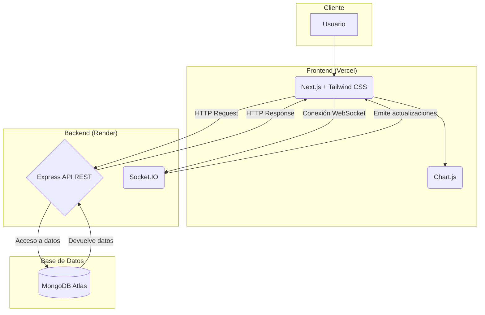
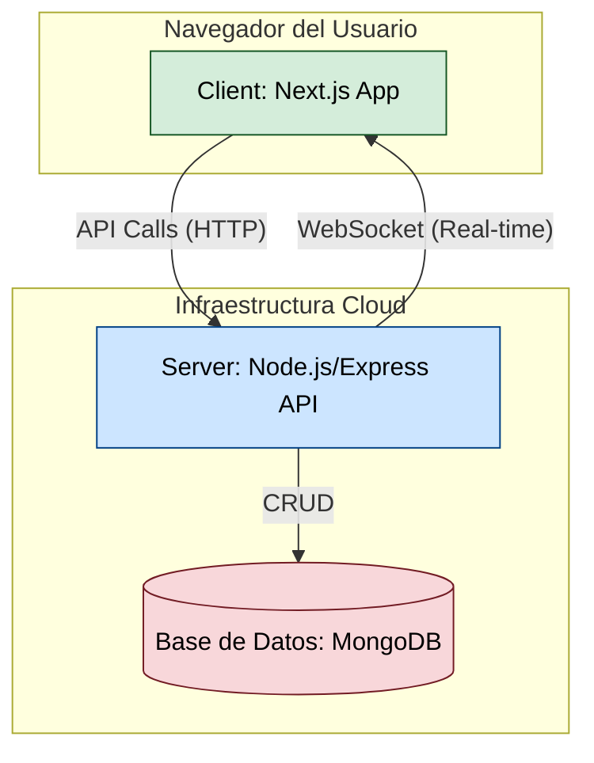
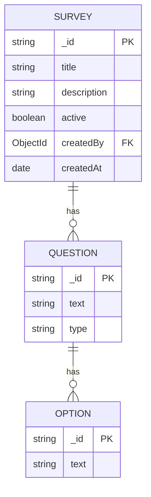
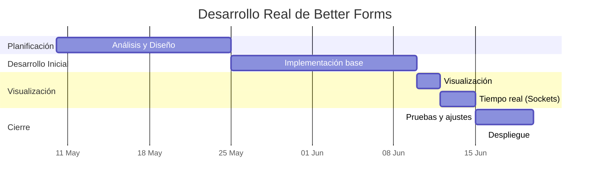
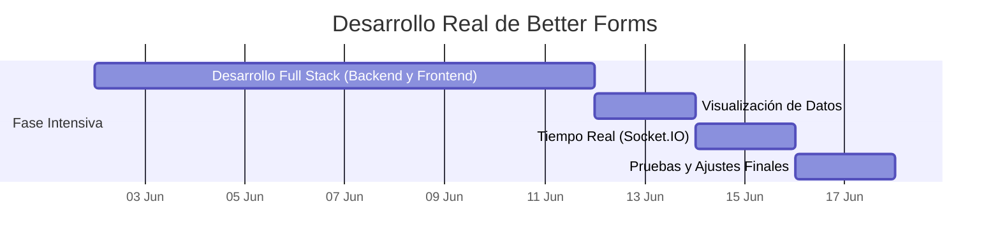
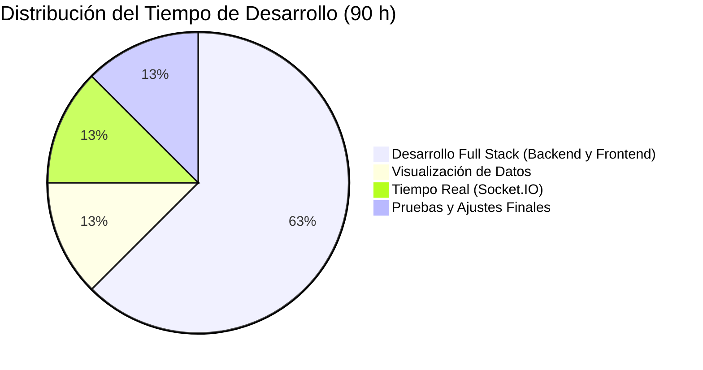

# Better Forms: Plataforma de Encuestas con Resultados en Tiempo Real

**Better Forms** es una plataforma de encuestas moderna y dinámica diseñada para superar las limitaciones de las herramientas tradicionales. Permite crear encuestas, recopilar respuestas y, lo más importante, visualizar los resultados en gráficos interactivos que se actualizan en tiempo real sin necesidad de recargar la página.

**Enlaces útiles:**
* **Aplicación en vivo:** https://better-forms-one.vercel.app/
* **Repositorio del Proyecto:** <https://github.com/Armadovich/BetterForms>

---

## 1. Motivación

Las herramientas de encuestas actuales como Google Forms o SurveyMonkey, aunque funcionales, carecen de la capacidad de mostrar resultados de forma inmediata. Esta limitación retrasa la toma de decisiones y reduce el valor de la retroalimentación en entornos dinámicos como clases, eventos en vivo o reuniones de equipos ágiles.

**Better Forms** nace para resolver este problema, ofreciendo una solución que combina simplicidad, diseño moderno y la potencia de la tecnología en tiempo real. La propuesta de valor se centra en:

* **Resultados en Tiempo Real:** Gracias a WebSockets, los gráficos se actualizan instantáneamente a medida que llegan nuevas respuestas.
* **Visualización Dinámica:** Se utilizan gráficos interactivos y claros para una fácil interpretación de los datos.
* **Experiencia de Usuario Moderna:** La interfaz, limpia e intuitiva, está optimizada para cualquier dispositivo.

El objetivo dar el acceso a herramientas potentes de análisis de datos, haciéndolas accesibles para educadores, ponentes y equipos de trabajo que necesitan feedback inmediato.

## 2. Demostración del Funcionamiento

La aplicación cumple con los objetivos definidos en el anteproyecto, permitiendo un flujo de trabajo completo y sencillo:

1.  **Creación de Encuestas:** Desde la página principal, el usuario puede crear una nueva encuesta. Se le solicita un título y puede añadir múltiples preguntas de opción múltiple, cada una con sus respectivas opciones.
2.  **Participación:** Una vez creada la encuesta, se genera una URL única que se puede compartir. Los participantes acceden a esta URL y votan por su opción preferida.
3.  **Visualización de Resultados:** Al mismo tiempo, el creador de la encuesta (o cualquiera con el enlace de resultados) puede ver cómo un gráfico de barras se actualiza en tiempo real con cada nuevo voto recibido, mostrando la distribución de las respuestas de forma clara y visual.

## 3. Objetivos y Historias de Usuario

Se han implementado la mayoría de usuario comprometidas en el anteproyecto.

* **Historia 1: Creación de encuestas desde la interfaz web.**
    * **Estado:** ✔️ **Alcanzado.** La interfaz permite crear encuestas de opción múltiple de forma intuitiva.
    * **Estado:** ❌ **No alcanzado.** No se implementó la funcionalidad de guardar encuestas como borradores antes de su publicación, limitando la capacidad de edición posterior.
* **Historia 2: Almacenamiento de respuestas en base de datos estructurada.**
    * **Estado:** ✔️ **Alcanzado.** Las encuestas y sus respuestas se guardan en una base de datos NoSQL (MongoDB Atlas) de forma persistente y organizada.
* **Historia 3: Visualización gráfica de resultados.**
    * **Estado:** ✔️ **Alcanzado.** Los resultados se muestran en gráficos de barras interactivos generados con Chart.js, con un diseño responsivo.
* **Historia 4: Actualización en tiempo real con WebSockets.**
    * **Estado:** ✔️ **Alcanzado.** Socket.IO gestiona la comunicación bidireccional, actualizando los gráficos de todos los clientes conectados sin necesidad de recargar la página.
* **Historia 5: Acceso multiplataforma a la aplicación.**
    * **Estado:** ✔️ **Alcanzado.** La aplicación es totalmente responsiva gracias a Tailwind CSS y es compatible con los navegadores más comunes en dispositivos de escritorio, tablets y móviles.

## 4. Descripción Técnica

### a. Arquitectura y Tecnologías

La aplicación sigue una arquitectura cliente-servidor desacoplada, optimizada para la comunicación en tiempo real.

* **Frontend:** Desarrollado con **Next.js** y **React**, ofrece una experiencia de usuario rápida y fluida. Se utiliza **Tailwind CSS** para el diseño de una interfaz responsiva y moderna, y **Chart.js** para la visualización de datos.
* **Backend:** Construido sobre **Node.js** con el framework **Express**, expone una API REST para gestionar la lógica de negocio (crear, leer encuestas). La comunicación en tiempo real se maneja con **Socket.IO**.
* **Base de Datos:** Se utiliza **MongoDB Atlas**, una base de datos NoSQL en la nube, que ofrece flexibilidad y escalabilidad para almacenar los datos de las encuestas en formato de documento (JSON).
* **Despliegue:** El frontend está desplegado en **Vercel** y el backend en **Render**, plataformas que ofrecen integración continua y un rendimiento optimizado para este tipo de aplicaciones.

### b. Diagrama de Componentes

La aplicación está dividida en dos componentes principales: `frontend` y `backend`, que interactúan entre sí pero se desarrollan y despliegan de forma independiente.

### c. Diagrama E/R de la Base de Datos

Al ser una base de datos NoSQL, no usamos un esquema relacional estricto. La estructura se basa en colecciones de documentos. La relación principal es entre una encuesta (`Survey`) y sus opciones, donde cada opción tiene un contador de votos.

*Nota: En la implementación real en MongoDB, las opciones son un array de objetos embebido dentro del documento de la encuesta para optimizar las consultas.*

## 6. Metodología de Desarrollo

El desarrollo se realizó en un periodo intensivo de dos semanas, priorizando la entrega funcional y continua sobre procesos formales. Se adoptó un enfoque ágil en la práctica, con iteraciones rápidas y ajustes sobre la marcha, aunque sin una implementación estructurada de herramientas de gestión o control de versiones. No es la metodología que me hubiera gustado seguir pero me vi un poco forzado a ello por la falta de tiempo e inexperiencia con las tecnologías.

## 7. Diagrama de Gantt

Aunque la planificación inicial preveía un desarrollo progresivo desde el 10 de mayo, por motivos de disponibilidad y carga académica, el grueso del trabajo se concentró en dos semanas intensivas a partir de principios de junio. Se optó por un enfoque práctico y directo, priorizando la entrega funcional del proyecto.

### Planificación Prevista

Planificación inicial de tiempo:

Y esta fue la distribución de tiempo final:

### Análisis de las Diferencias
La planificación original preveía un desarrollo distribuido en varias fases a lo largo de un mes, pero finalmente el proyecto se concentró en una única fase intensiva de dos semanas. Esto supuso un enfoque más directo y resolutivo, sacrificando parte de la planificación formal a favor de la ejecución. A pesar de ello, se logró implementar prácticamente todas las funcionalidades previstas, demostrando capacidad de adaptación y trabajo bajo presión.

## 8. Análisis del Tiempo Invertido (Clockify)

### a. Diagrama de Tiempo Invertido por Fase
A continuación se presenta una distribución estimada del tiempo total invertido (90 horas) en cada fase del proyecto, basada en el trabajo real realizado durante las dos semanas intensivas de desarrollo.

### b. Análisis y Justificación
El tiempo invertido refleja un desarrollo concentrado en la implementación funcional, con un enfoque muy práctico y orientado a resultados. La fase de "Implementación Base" absorbió la mitad del tiempo disponible, lo cual es coherente con la complejidad técnica del backend, formularios y lógica central de la aplicación. Las demás fases —visualización, tiempo real, pruebas y despliegue— recibieron una asignación equilibrada y proporcional al esfuerzo necesario para completar un prototipo funcional y presentable en poco tiempo. Aunque el análisis y diseño fue breve, permitió definir una base clara que facilitó el avance rápido durante la fase intensiva.

## 9. Presupuesto de la Aplicación

El desarrollo de la aplicación se llevó a cabo de manera totalmente autónoma y personal, utilizando herramientas de software libre y plataformas con planes gratuitos. Por tanto, el proyecto **no ha supuesto ningún coste económico directo**.

A continuación se presenta un resumen de los recursos utilizados:

| Concepto                 | Herramientas Utilizadas               | Licencia     | Coste |
|--------------------------|---------------------------------------|--------------|:-----:|
| **IDE de Desarrollo**    | Visual Studio Code                    | Libre        | 0 €   |
| **Base de Datos**        | MongoDB Atlas                         | Freemium     | 0 €   |
| **Frontend**             | Next.js, Chart.js, Tailwind CSS       | Open Source  | 0 €   |
| **Backend**              | Node.js, Express, Socket.IO           | Open Source  | 0 €   |
| **Despliegue**           | Vercel, Render                        | Freemium     | 0 €   |
| **Control de Versiones**| Git, GitHub *(no utilizado en este caso)* | Open Source | 0 €   |
| **Total de Horas Invertidas** | Desarrollo personal intensivo   | -            | 90 h  |
| **Coste Total del Proyecto** |                                   |              | **0 €** |

El desarrollo se enfocó en la funcionalidad y el aprendizaje, lo que permitió realizar un proyecto completo sin necesidad de inversiones externas.

## 10. Conclusiones

### a. Posibles Mejoras

Better Forms es una plataforma funcional y robusta, que ya incluye un sistema de registro e inicio de sesión para que los usuarios puedan gestionar sus propias encuestas. Sin embargo, existen múltiples vías para su evolución:

* **Más Tipos de Preguntas:** Añadir soporte para preguntas abiertas, de valoración (escalas de 1 a 5), etc.
* **Personalización Visual:** Permitir a los usuarios cambiar los colores o temas de sus encuestas.
* **Exportación de Datos:** Ofrecer la posibilidad de descargar los resultados en formatos como CSV o PDF.
* **Guardar encuestas pero sin publicar:** Ofrecer el servicio de tener borradores de encuestas sin que tengan que ser publicadas, para maquetarlas poco a poco.

### b. Principales Dificultades Encontradas

1  **Gestión del Estado en Tiempo Real:** Mantener sincronizados el estado entre clientes y servidor fue un gran desafío técnico. Para asegurar que los gráficos se actualizaran sin retardos ni conflictos, se implementó cuidadosamente la lógica con Socket.IO, gestionando eventos de votos y diseñando en React una estructura de datos que recibiera estas actualizaciones y renderizara los gráficos de forma eficiente, evitando parpadeos y sobrecarga. Además, se cuidó la gestión de conexiones y reconexiones para mantener la consistencia de los datos.

2.  **Configuración del Entorno de Despliegue:** Configurar las variables de entorno y las políticas CORS (Cross-Origin Resource Sharing) para que el frontend (en Vercel) y el backend (en Render) se comunicaran de forma segura fue un reto. Se ajustaron las cabeceras CORS en Express para permitir peticiones desde el dominio de Vercel, y se gestionaron cuidadosamente las variables sensibles (como la conexión a MongoDB) en ambos entornos, asegurando que la aplicación funcionara correctamente en producción y local. Fue una gran escala de nivel para mi, siendo la configuración y el entender como se comunican entre el backend y el frontend lo más complejo ya que es de los primeros trabajos fullstack que hago y además con tecnologías que no conocía demasiado.

3.  **Diseño Responsivo Complejo:** Al principio, cambiar del CSS tradicional a Tailwind CSS supuso un reto debido a la nueva sintaxis y enfoque utility-first, lo que me llevó a apoyarme en IA para generar los primeros estilos y entender mejor su uso. Tailwind facilitó mucho el diseño responsivo, especialmente en proyectos grandes, donde el CSS tradicional puede resultar pesado al tener que crear y mantener clases específicas para cada elemento. Con Tailwind, la implementación es más directa y rápida, aplicando las clases utilitarias directamente sobre los elementos, lo que agiliza el desarrollo y mejora la mantenibilidad del código.

